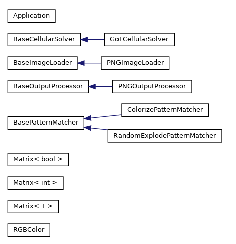

# Image ➡️ Game of life

This project loads a PNG image, converts it to a binary form and plays [Conway's Game of Life](https://en.wikipedia.org/wiki/Conway%27s_Game_of_Life) on it.

## What this program does

<table>
<tr>
<td></td><td></td>
</tr>
<tr>
<td>Load PNG image - Use <i>libpng</i></td><td>Turn it to binary form</td>
</tr>
</table>

## Run Game of life

This program implements two version os Game of Life (GoL)

### Standard GoL

[Conway's Game of Life](https://en.wikipedia.org/wiki/Conway%27s_Game_of_Life) with some patterns colored for better visibility.

### Custom GoL

Custom algorithm adds concept of stars which can explode. This brings more activity to the standard algorithm.  
When star explores, it turns its surrounding to a random state.

There are two types of stars

* Small Star
    * Visualised in orange 🟠
    * One line consists of 3 cells
    * Star explodes randomly
    
* Big star
    * Visualised in red 🔴
    * Consists of 3 separate lines
    * Star explodes randomly
    


<table>
<tr>
<td></td><td></td>
</tr>
<tr>
<td><b>Custom GoL</b> - Image shows small star (orange) in the middle of the screen exploding and turning into a big star (red) which later explodes too.</td>
<td><b>Standard GoL</b> - Small and Big stars remains stable</td>
</tr>
</table>


### Comparison of standard and custom GoL

2724 steps has been generated from the same starting image shown above.

<table>
<tr>
<td></td><td></td>
</tr>
<tr>
<td><b>Standard</b> Game of Life</td><td><b>Custom</b> Game of Life</td>
</tr>
</table>

## Classes



## CLI interface

```
Usage: img2gol INPUT_IMAGE PATTERNS_DIR OUTPUT_DIR NUM_STEPS SOLVER

Program that loads a PNG image, converts it to a binary form and runs Game of Life on it.

Arguments:
INPUT_IMAGE             - PNG file to be loaded. Can be RGB or RGBA
PATTERNS_DIR            - Directory where are stored pattern files provided with the software
OUTPUT_DIR              - Directory where will be stored files of each step of Game of Life
NUM_STEPS               - How many steps program should run Game of Life
SOLVER                  - 0 for standard Conway's Game of Life. 1 for Custom Game of Life algorithm

Custom Game of Life algorithm :
Custom Game of Life algorithm runs standard Conway's Game of Life with new concept of stars.
Star is a repeating pattern in shape of a star. There are two types of stars in my algorithm.
Star can explode at any time. When star explodes it changes its surrounding to a random state.
```

## Valgrind

```
make runvalgrind

valgrind --leak-check=full ./pavelkral ./examples/test_image_forrest_crop.png ./assets/patterns/ ./examples/out 2 0
==1549== Memcheck, a memory error detector
==1549== Copyright (C) 2002-2017, and GNU GPL'd, by Julian Seward et al.
==1549== Using Valgrind-3.14.0 and LibVEX; rerun with -h for copyright info
==1549== Command: ./pavelkral ./examples/test_image_forrest_crop.png ./assets/patterns/ ./examples/out 2 0
==1549== 
----------------------------
Input file         - ./examples/test_image_forrest_crop.png
Pattern directory  - ./assets/patterns/
Output directory   - ./examples/out
Number of steps    - 2
Solver type        - 0
----------------------------
Initializing standard Game of Life
Image saved to ./examples/out/0.png
Step : 0
Image saved to ./examples/out/1.png
Processing time 43.884953 s
Step : 1
Image saved to ./examples/out/2.png
Processing time 44.763950 s
==1549== 
==1549== HEAP SUMMARY:
==1549==     in use at exit: 0 bytes in 0 blocks
==1549==   total heap usage: 6,210 allocs, 6,210 frees, 8,419,511 bytes allocated
==1549== 
==1549== All heap blocks were freed -- no leaks are possible
==1549== 
==1549== For counts of detected and suppressed errors, rerun with: -v
==1549== ERROR SUMMARY: 0 errors from 0 contexts (suppressed: 0 from 0)
```
